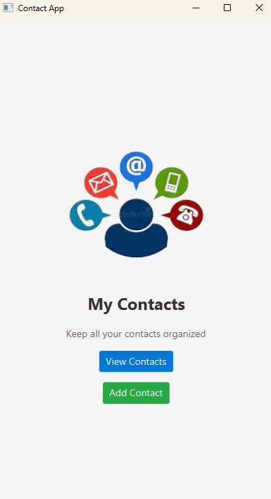
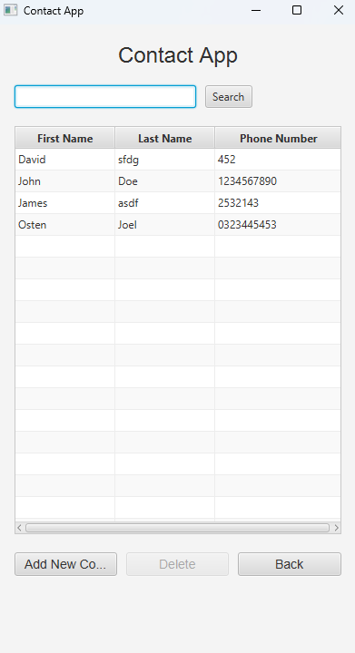
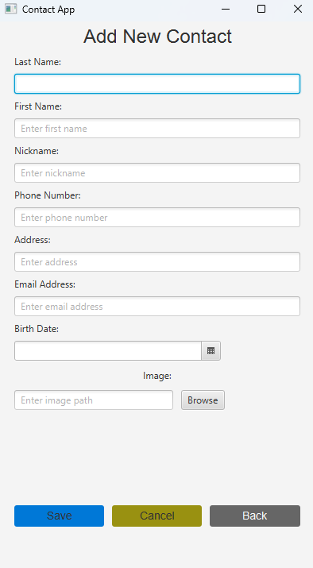
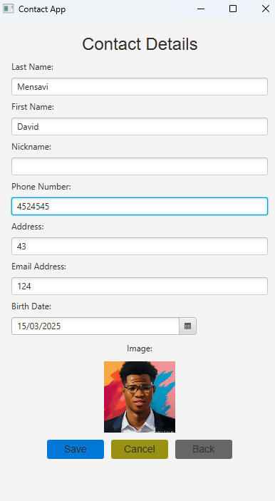

---

# ContactApp 📇

Welcome to **ContactApp**, a JavaFX-based contact management application built with Maven! This app allows you to create, view, update, and delete contacts with ease, featuring a sleek UI and robust database integration. Whether you're managing personal connections or professional networks, ContactApp has you covered! 🚀

---

## Table of Contents

- [Features](#features-✨)
- [Technologies](#technologies-🛠️)
- [Project Structure](#project-structure-📂)
- [Setup Instructions](#setup-instructions-⚙️)
- [Running the Application](#running-the-application-🏃‍♂️)
- [Testing](#testing-🧪)
- [Usage](#usage-📋)
- [Screenshots](#screenshots-📸)
- [Contributing](#contributing-🤝)
- [License](#license-📜)

---

## Features ✨

- **Add Contacts**: Create new contacts with details like name, phone number, email, address, birth date, and an optional profile image. 📝
- **View All Contacts**: Browse a table of all contacts with search functionality to filter by name or phone number. 🔍
- **Edit Contacts**: Update existing contact details with an intuitive form. ✏️
- **Delete Contacts**: Remove contacts with a confirmation dialog for safety. 🗑️
- **Image Support**: Upload and display profile images for contacts. 🖼️
- **Validation**: Ensures required fields are filled and email addresses are valid. ✅
- **Navigation**: Seamless transitions between pages (Home, Add, View, Details, Delete). 🌐

---

## Technologies 🛠️

- **Java**: Version 17 (compatible with 23 with adjustments) ☕
- **JavaFX**: For the graphical user interface 🎨
- **Maven**: Dependency management and build tool 🏗️
- **JDBC**: Database connectivity with SQLite (or your chosen DB) 🗄️
- **JUnit 5**: Unit testing framework 🧪
- **Mockito**: Mocking for unit tests 🎭
- **TestFX**: Testing JavaFX components 🤖
- **AssertJ**: Fluent assertions for readable tests 📜

---

## Project Structure 📂

```
contactapp/
├── src/
│   ├── main/
│   │   ├── java/
│   │   │   └── org/project/contactapp/
│   │   │       ├── controllers/       # JavaFX controllers
│   │   │       │   ├── AddContactController.java
│   │   │       │   ├── AllContactsController.java
│   │   │       │   ├── ContactDetailsController.java
│   │   │       │   ├── DeleteContactController.java
│   │   │       │   └── HomePageController.java
│   │   │       ├── daos/             # Data Access Objects
│   │   │       ├── entities/         # Data models
│   │   │       ├── utils/            # Utility classes
│   │   │       ├── DatabaseConnection/  # DB connection utility
│   │   │       └── MainApp.java      # Application entry point
│   │   └── resources/
│   │       └── org/project/contactapp/
│   │           ├── images/           # App images and screenshots
│   │           │   ├── add_contact.png
│   │           │   ├── allcontacts.png
│   │           │   ├── contact_details.png
│   │           │   └── home.png
│   │           └── *.fxml            # FXML files for UI layouts
│   └── test/
│       └── java/
│           └── org/project/contactapp/
│               └── controllers/      # Unit tests for controllers
├── pom.xml                           # Maven configuration
└── README.md                         # You're reading it! 😊
```

---

## Setup Instructions ⚙️

### Prerequisites
- **Java JDK**: 17 or later (tested with 23, see notes below) ☕
- **Maven**: 3.6.0+ 🏗️
- **Database**: SQLite or your preferred JDBC-compatible database 🗄️
- **IDE**: IntelliJ IDEA, Eclipse, or any Java-supporting IDE (optional but recommended) 💻

### Steps
1. **Clone the Repository**:
   ```bash
   git clone https://github.com/yourusername/contactapp.git
   cd contactapp
   ```

2. **Configure the Database**:
   - Update `dbConnection.java` with your database connection details (URL, username, password).
   - Ensure the `person` table exists with columns: `id`, `lastname`, `firstname`, `nickname`, `phone_number`, `address`, `email_address`, `birth_date`, `image_path`.

3. **Install Dependencies**:
   ```bash
   mvn clean install
   ```

4. **Java 23 Notes**:
   - If using Java 23, update Mockito and Byte Buddy in `pom.xml` to versions supporting Java 23 (e.g., Mockito 5.14.0+, Byte Buddy 1.15.7+), or downgrade to Java 17 for full compatibility with current dependencies.

---

## Running the Application 🏃‍♂️

1. **Compile and Run**:
   ```bash
   mvn javafx:run
   ```

2. **Default Entry Point**:
   - The `MainApp` class launches the application, starting at the `home-page.fxml`.

3. **Expected Output**:
   - A window opens with the Home page, offering "View Contacts" and "Add Contact" options.

---

## Testing 🧪

### Running Tests
- Execute all unit tests with:
  ```bash
  mvn test
  ```

### Test Coverage
- **Controllers**: Tests for navigation, input validation, and database interactions.
- **DAO**: Tests for CRUD operations (`getAllPersons`, `savePerson`, `updatePerson`, `deletePerson`).
- **Notes**: UI-specific interactions (e.g., `Alert`, `FileChooser`) are not fully tested in unit tests; consider integration tests for complete coverage.

---

## Usage 📋

1. **Home Page**:
   - Click "View Contacts" to see all contacts.
   - Click "Add Contact" to create a new contact.

2. **Add Contact**:
   - Fill in required fields (last name, first name, phone number).
   - Optionally add nickname, address, email, birth date, and an image.
   - Save to store the contact or cancel to return home.

3. **View All Contacts**:
   - Browse contacts in a table.
   - Search by name or phone number.
   - Double-click a contact to view/edit details.
   - Select a contact and click "Delete" to remove it.

4. **Edit Contact**:
   - Update contact details and save or cancel to revert changes.

5. **Delete Contact**:
   - Confirm deletion; successful deletion returns to the all contacts page.

---

## Screenshots 📸

Here are some screenshots showcasing the **ContactApp** in action!

### Home Page


### All Contacts Page


### Add Contact Page


### Contact Details Page


---

## Contributing 🤝

We welcome contributions! Here’s how to get involved:

1. **Fork the Repository**.
2. **Create a Branch**:
   ```bash
   git checkout -b feature/your-feature-name
   ```
3. **Commit Changes**:
   ```bash
   git commit -m "Add your feature"
   ```
4. **Push and Open a Pull Request**:
   ```bash
   git push origin feature/your-feature-name
   ```

- Follow Java coding standards and add tests for new features. 🙌

---

## License 📜

This project is licensed under the MIT License. See the [LICENSE](LICENSE) file for details.

---

## Acknowledgments 🌟

- Thanks to the JavaFX community for an awesome UI framework!
- Shoutout to xAI for inspiring this assistant-driven documentation! 🤖

Happy coding, and enjoy managing your contacts with ContactApp! 💼

---
